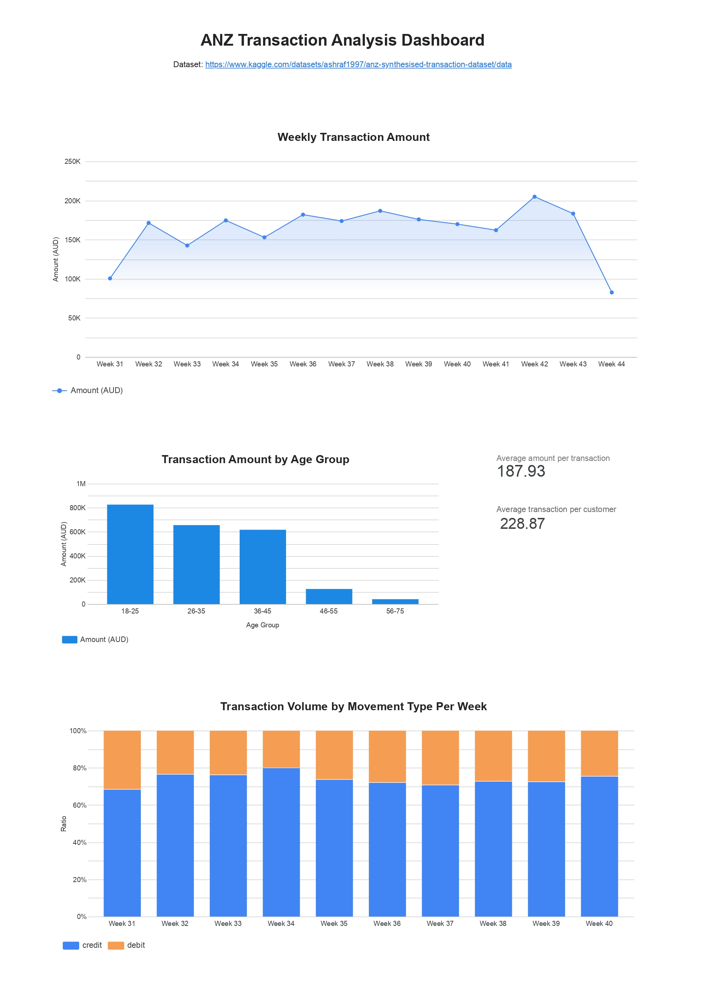

# ANZ Transaction Case Study

## Description
This project is my first hands-on data analysis project, focused on exploring customer transaction behavior using SQL in Google BigQuery.

Rather than only analyzing activity, this case study emphasizes how transaction patterns translate into **financial outcomes** — particularly fee-based revenue (simulated at a 0.3% rate, inspired by common trading platform models such as Indodax).

---

## Business Questions
1. When do peak transaction periods occur, and how do they impact estimated fee revenue (assuming a 0.3% transaction fee)?
2. Which age segments drive the highest transaction volume and fee revenue?
3. What is the average transaction value per customer, and what does it suggest about user behavior?
4. How does weekly cash flow trend — are customers in net inflow or outflow, and which periods show the healthiest balance?

---

## Dataset
- **Source:** [ANZ Synthesised Transaction Dataset](https://www.kaggle.com/datasets/ashraf1997/anz-synthesised-transaction-dataset/data)
- **Size:** 12,043 rows
- **Period:** August – October 2018
- **Key columns:** `transaction_id`, `customer_id`, `date`, `amount`, `balance`, `movement`, `age`, `gender`, `txn_description`

---

## Tools Used
- Google BigQuery  
- SQL (BigQuery dialect)  
- Google Looker Studio  

---

## Dashboard
[View Interactive Dashboard](https://datastudio.google.com/reporting/ce4ff4cb-3c87-414f-883b-654abc15cdce)

---

## Dashboard Preview


---

## Key Insights

**1. Transaction Volume vs Revenue**
Peak transaction activity occurred in week 41 of 2018, with a total transaction amount of AUD 197,109. However, higher transaction volume did not always translate to higher revenue.

In some cases, weeks with lower total transaction volume generated higher estimated fee revenue — suggesting that **transaction value, not just volume, plays a critical role in revenue generation**.

---

**2. Age Segment Contribution**
Customers aged 18–25 represent 47% of the dataset and contribute the highest share of transaction volume and estimated fee revenue.

This may indicate strong engagement from younger users, though further validation is needed to rule out dataset bias.

---

**3. Customer Transaction Behavior**
The average transaction value per customer is AUD 228.87, providing a baseline for understanding user spending behavior.

When combined with revenue insights, this metric helps explain why lower-volume periods can still generate strong financial outcomes.

---

**4. Cash Flow Patterns**
Despite debit transactions occurring more frequently, total credit amounts consistently dominated across all weeks — largely driven by high-value inflows such as salary deposits.

As a result, customers remained in a **net inflow position** throughout the observed period. Week 43 showed the healthiest credit-to-debit ratio, while week 40 had the lowest.

---

## File Structure
```
queries/
├── 01_weekly_trend.sql         — Weekly transaction trend & estimated fee
├── 02_age_group_analysis.sql   — Age group contribution to volume & fee
├── 03_avg_transaction.sql      — Average transaction value per customer
└── 04_net_cashflow.sql         — Weekly net cash flow & credit/debit ratio
```
---

## Notes
- Fee estimation (0.3%) is a simulation to contextualize this analysis within a trading platform context and does not reflect actual ANZ fee structures.
- This project is built for learning purposes as part of a data analyst portfolio.
